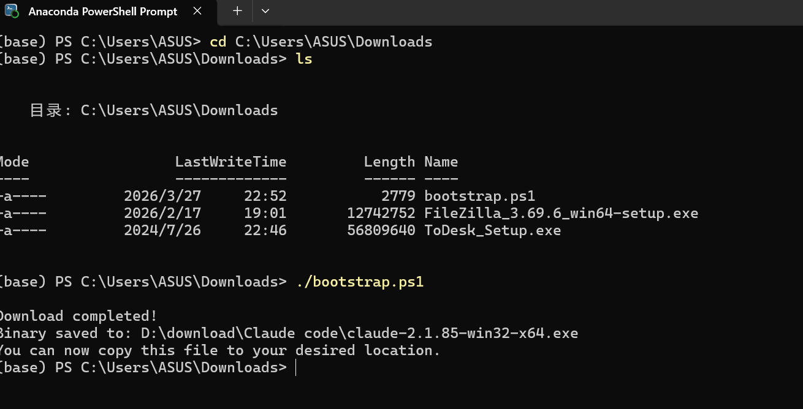
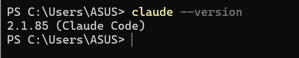

# Claude Code 使用教程

## 一、下载与安装

1.简介：Claude Code 是一个“命令行工具”：它没有图形界面，运行在你的终端里，像是一个可以和你对话、帮你干活的“文字命令高手”。

2.Windows-->可选择Powershell终端命令安装。

  方法1：一键安装
  
    irm https://claude.ai/install.ps1 | iex

    说明：
    irm 是 Invoke-RestMethod 的别名，它的作用是向指定的 URL 发送 HTTP 请求，并获取返回的内容;
    https://claude.ai/install.ps1 — 脚本源地址;
    | — 管道符,将左边命令的输出作为右边命令的输入传递过去;
    iex 是 Invoke-Expression 的别名，它的作用是将传入的字符串作为 PowerShell 代码执行。

    问题：
    方法1难以自定义下载位置。

  方法2：先下载ps1文件到本地，修改下载路径后运行。

    [1]首先去https://claude.ai/install.ps1官网下载bootstrap.ps1文件到本地；
    [2]修改其中约第24行代码
      原先
      $DOWNLOAD_DIR = "$env:USERPROFILE\.claude\downloads"
      改为新的（添加你自己的路径）
      $DOWNLOAD_DIR = "D:\ClaudeCode\.claude\downloads"
    [3]注释掉安装代码以及自行添加安装结束的提示代码
      注释掉从# Run claude install to set up launcher and shell integration到最后的代码
      添加安装结束的提示代码可以由DeepSeek生成  
    [4]在PowerShell中运行bootstrap.ps1

    [5]配置Path
      搜索系统环境变量-->环境变量-->用户变量-->编辑已存在的Path-->新建-->将ClaudeCode.exe所在的文件夹位置写入-->确定-->确定
    [6]测试是否配置成功
      在新开的PowerShell中运行
      

    
## 二、
